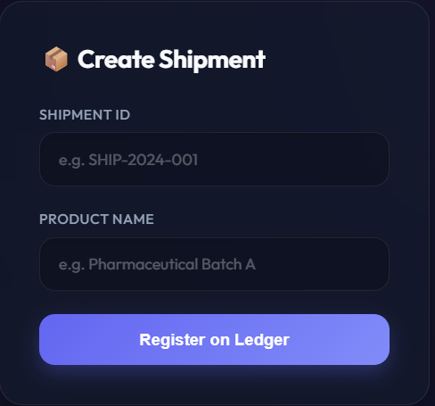
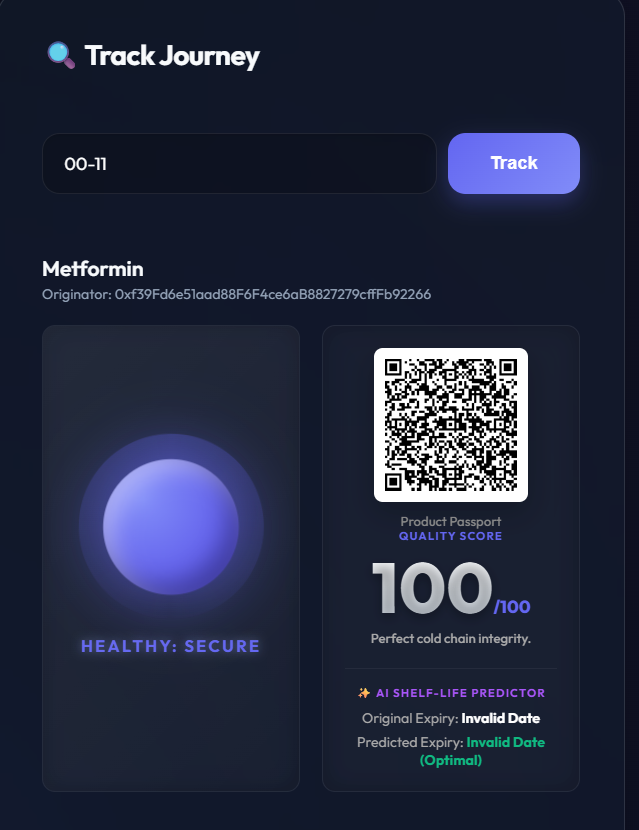
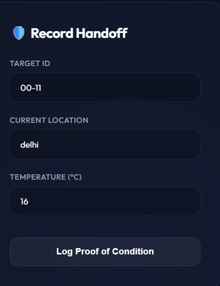
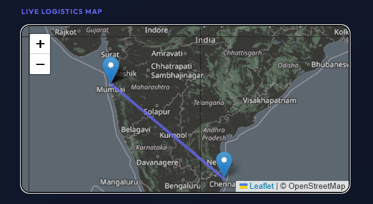
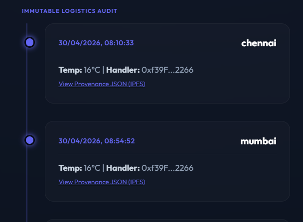
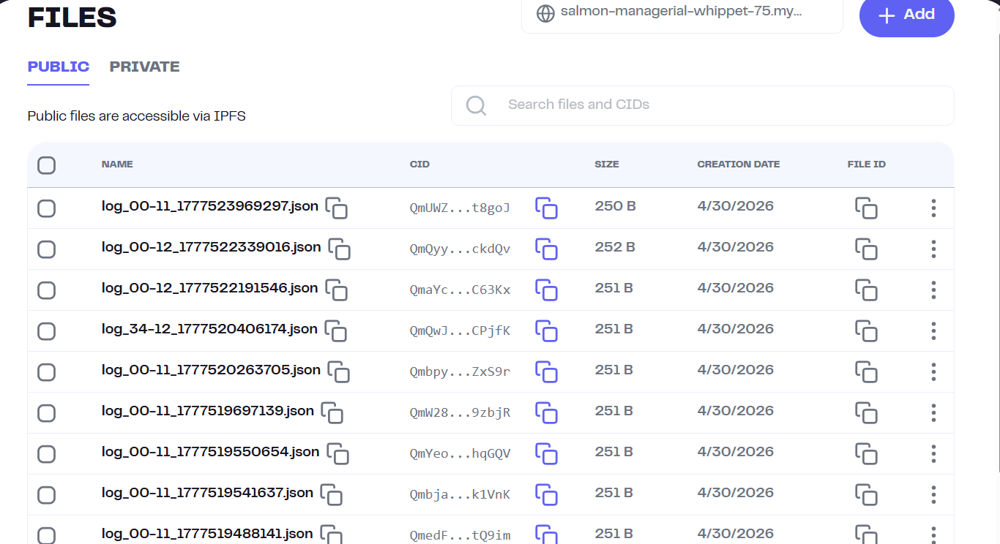
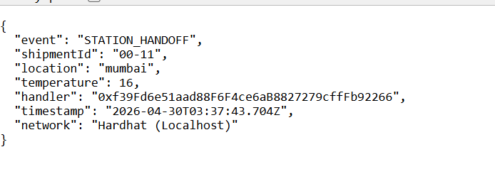
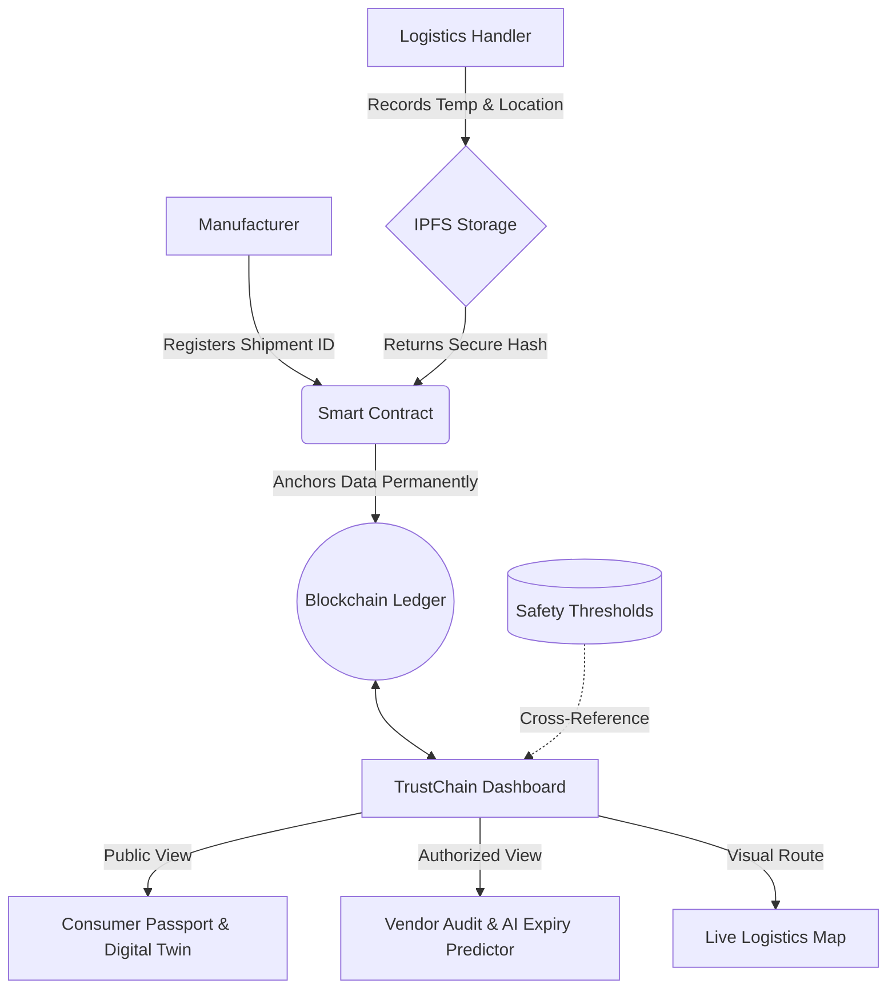

# 🛡️ TrustChain: Perishable Goods Provenance Platform

## ⚠️ Problem Statement
Supply chains for perishable goods (pharmaceuticals, fresh food, biologics) suffer from extreme opacity and a lack of verifiable trust. When a thermal breach or mishandling occurs, accountability is lost in a black box of fragmented databases and paper trails. 

**The Challenge:** Build a blockchain-based provenance system specifically for perishable goods supply chains that creates an immutable, timestamped record at every custody handoff, anchors uploaded supply chain documents, allows any stakeholder to independently verify the full document trail of a shipment in real time, and flags anomalies automatically.

---

## 💡 Proposed Solution
TrustChain is a Web3 logistics tracking platform designed to guarantee data integrity, protect corporate privacy, and automate compliance monitoring. 

Instead of relying on a centralized database that can be edited or tampered with by bad actors, TrustChain uses an Ethereum Smart Contract to permanently anchor custody handoffs. 

### Key Innovations:
1. **Decentralized Storage:** Detailed logistics data (documents, temperatures, locations) are compiled into JSON logs and stored on IPFS (Pinata). Only the cryptographically secure CID Hash is anchored on-chain, keeping gas costs low.
2. **Dual-Layer Visibility (Privacy):** 
   - **Consumers:** Scan a QR code to view a "Product Passport" and a dynamic Digital Twin showing the high-level health status.
   - **Vendors:** Authorized wallets unlock a deep-audit timeline, revealing specific warehouses, handlers, and thermal records.
3. **Heuristic AI Quality Scoring:** The frontend automatically cross-references blockchain temperature logs against a strict master database (`medicines.csv`). If a thermal breach is detected, the "Digital Twin" orb turns red, and the dynamic expiry date is instantly slashed.
4. **Live Logistics Mapping:** Real-time visual route mapping using Leaflet and OpenStreetMap API to trace the physical journey of the asset.

---

## 📸 Screenshots

<div align="center">
  
  
  
  
  
  
  
</div>

---

## 🏗️ Architecture Diagram



---

## 🛠️ Technology Stack
* **Blockchain/Smart Contracts:** Solidity, Hardhat, Ethers.js (v6)
* **Decentralized Storage:** IPFS, Pinata API
* **Frontend UI:** Vanilla JS, CSS Glassmorphism, QRCode.js
* **Mapping/Geocoding:** Leaflet.js, OpenStreetMap Nominatim API

---

## 🚀 How to Run Locally

1. **Start the Blockchain:**
   ```bash
   npx hardhat node --hostname 127.0.0.1 --port 8888
   ```

2. **Deploy & Authorize:**
   ```bash
   npx hardhat run scripts/deploy.cjs --network localhost
   npx hardhat run scripts/authorize_handler.cjs --network localhost
   npx hardhat run scripts/authorize_vendor.cjs --network localhost
   ```

3. **Start the Interface:**
   ```bash
   npx serve frontend
   ```
   Navigate to `http://127.0.0.1:3000` and connect your MetaMask wallet to the `http://127.0.0.1:8888` RPC.
